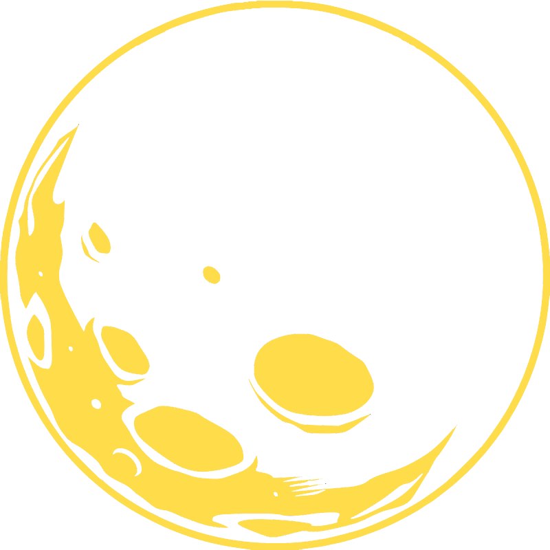

# Moonshot Extensions
#### A Growing List of Useful Extensions for Building just iOS Applications (for now)
Check out the .swift files.  :)

### Recommended Various Others:
- Host a Static Site?  [Netlify.com](www.netlify.com) is amazing.
- (Awesome Swift)[https://github.com/matteocrippa/awesome-swift]
